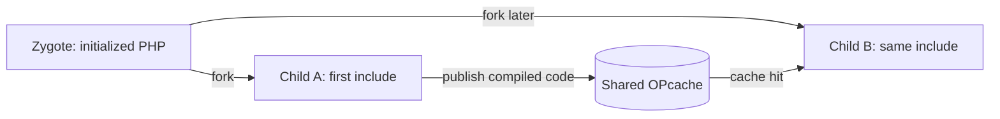

# Sharing code learned by Polychrome children

Investigated on 2026-09-12 against the installed Polychrome 0.1.0 / PHP 8.5.10
NTS build and the matching PHP source in `.build/php-8.5.10`.

**Viable, and already supported by the current runtime.** OPcache supplies a
mutable shared code cache: when one disposable child compiles an eligible file,
other children can reuse it, including children subsequently forked from the
original parent. This does not require promoting a request child into the zygote,
feeding declarations back to the manager, or changing PHP internals.

The zygote's private PHP state stays at its startup baseline. Its OPcache mapping
is shared with its descendants and changes as they discover code. PHP's
[OPcache overview](https://www.php.net/manual/en/book.opcache.php) describes the
shared bytecode cache; the Linux mmap implementation explicitly allocates it with
[`MAP_SHARED | MAP_ANONYMOUS`](https://github.com/php/php-src/blob/php-8.5.10/ext/opcache/shared_alloc_mmap.c#L275).



[The SAPI defaults](../native/sapi.c) enable OPcache, disable JIT, reserve 256 MiB
for OPcache, and request capacity for 100,000 cache keys. [The manager](../src/manager.rs)
calls `poly_initialize()` before it forks workers. Each child calls
`php_child_init()`, runs normal PHP request startup/shutdown, and exits with
`_exit()`. The parent retains the shared mapping after the writer child exits.
`--no-preload` disables startup symbol preloading while retaining OPcache.

| Work/state learned by a child | Reused by another child? | Remaining work |
| --- | --- | --- |
| Compiled and optimized file opcodes | Yes, while the cache entry remains valid | Resolve/include the file and execute its top-level code |
| Eligible linked class definitions | Yes, through OPcache's inheritance cache | Load dependencies and register the class for that request |
| Shared interned strings and immutable code metadata | Yes | Request-local execution data still needs initialization |
| Class/function visibility in the request's symbol tables | No automatic promotion | Normal include/autoload remains necessary |
| Globals, changed static values, objects and Drupal services | No | Initialize them in the request |

PHP 8.5's `zend_accel_inheritance_cache_add()` persists eligible linked classes
under the shared allocation lock; its matching lookup reuses them and extends
the local map-pointer table when needed. Eligibility depends on the class and
its dependencies. This is more than a bytecode cache, but does not eliminate all
class-loading work. This conclusion comes from
[the OPcache implementation](https://github.com/php/php-src/blob/php-8.5.10/ext/opcache/ZendAccelerator.c#L2319)
and [the engine's eligibility checks](https://github.com/php/php-src/blob/php-8.5.10/Zend/zend_inheritance.c#L3501);
the probe below does not directly count inheritance-cache hits.

On a script cache hit, `zend_accel_load_script()` still installs functions/classes
into the current request's tables and handles delayed binding. That explains why
`class_exists('Learned', false)` can return false even when its file is cached.
See [PHP's script loader](https://github.com/php/php-src/blob/php-8.5.10/ext/opcache/zend_accelerator_util_funcs.c#L367).
Static-variable defaults can be stored with immutable code; live values use
separate map pointers. See [PHP's persistence code](https://github.com/php/php-src/blob/php-8.5.10/ext/opcache/zend_persist.c#L713).

**Runtime evidence.** Run the self-contained [probe](../benchmarks/opcache_probe.py):

```sh
python3 benchmarks/opcache_probe.py
```

It uses temporary application roots, Unix sockets and the existing FastCGI test
client. It creates the learned files only after manager startup, ages their
timestamps past the normal file-update protection window, and records per-request
PIDs, script hits, symbol visibility and reset counters in
`benchmarks/results/opcache-probe.json`. An alternate build can be selected with
`POLYCHROME_BIN`.

All assertions passed across 18 requests:

| Experiment | Observed result |
| --- | --- |
| One worker, automatic preloading off | Child A's first include cached `Learned.php` with zero hits; child B saw it already cached and raised its hits to one |
| One worker, automatic preloading on | The same behavior for a file created after startup; the startup seed class remained preloaded |
| Two workers, reader held inside an existing request | The reader saw the file uncached, then cached after its peer loaded it, then recorded a hit when it included it |
| Isolation during ordinary loads | Distinct child PIDs; class/function absent before include; global counter, static property and static local each reached one independently |
| Explicit compilation in a disposable child | A later child saw `Compiled.php` cached, while `Compiled` remained absent from its class table |
| Manual OPcache reset, with preloading off and on | The next request completed one cache restart, the learned entry disappeared, and a later child cached it again; startup-preloaded seed visibility was preserved |

The existing-sibling case distinguishes shared-memory publication from merely
inheriting an updated private parent heap. The serial cases demonstrate that the
cache survives the writer's disposal and remains usable by new children.

**How to use this.** Ordinary application traffic already warms the cache. For
predictable cold starts, send representative warmup requests through the same
Polychrome instance. A deliberately forked warmup child could also prime selected
files with
[`opcache_compile_file()`](https://www.php.net/manual/en/function.opcache-compile-file.php)
without executing their top-level code. Such compilation helps later includes;
it does not perform application bootstrap or all request-time class linking.
A separately launched CLI process does not inherit this manager's anonymous
mapping, so enabling CLI OPcache does not warm this running instance's shared cache.

Startup preloading is a separate choice: it makes selected symbols globally
available in advance. Runtime cache additions do not extend that preload set.
There is no public API to turn a newly learned file into additional persistent
startup symbols for an already-running zygote. PHP documents startup preloading
and its process-restart requirement in
[the preloading manual](https://www.php.net/manual/en/opcache.preloading.php).

The cache must have room for the learned working set. File age protection,
blacklisting and size limits can prevent a file being cached. Monitor hits/misses,
free/wasted memory and restart counters when evaluating a real workload; a
successful compilation alone does not establish retention. These controls are
documented in [OPcache configuration](https://www.php.net/manual/en/opcache.configuration.php).
Cache publication and restart coordination already belong to OPcache. The manual
reset probe covers a quiet request boundary, not cache exhaustion or a restart
under sustained concurrency.

**Performance implication.** This mechanism saves repeated parsing, compilation,
optimization and some linking. It does not remove fork/reap overhead, request
startup/shutdown, autoloader execution, top-level PHP execution or Drupal bootstrap.
The repository's [existing measurements](../benchmarks/RESULTS.md) already include
shared OPcache in every configuration. Their `--no-preload` results therefore
already measure a zygote whose shared code cache learns from children.

For example, those diagnostic Drupal login samples measured Polychrome at 159.9
requests/s and 32.5 MiB peak PSS without automatic preloading, versus 138.2
requests/s and 161.5 MiB with it. These are earlier, short measurements with
background load, not a new OPcache-on/off comparison or proof that preloading
always loses. The investigation adds functional evidence, not a new throughput
claim.

For the stated goal, use the existing shared OPcache path. Keep `--no-preload` as
the comparison baseline and evaluate selective startup preloading only for
additional measured benefit. Any further implementation should target an observed
remaining cost or operational need, such as optional warmup or cache statistics;
sharing code learned by children itself requires no runtime change.
